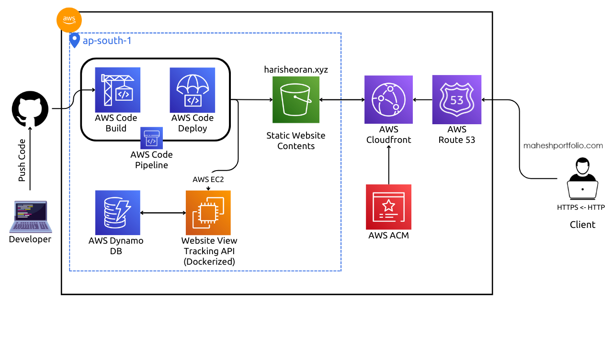
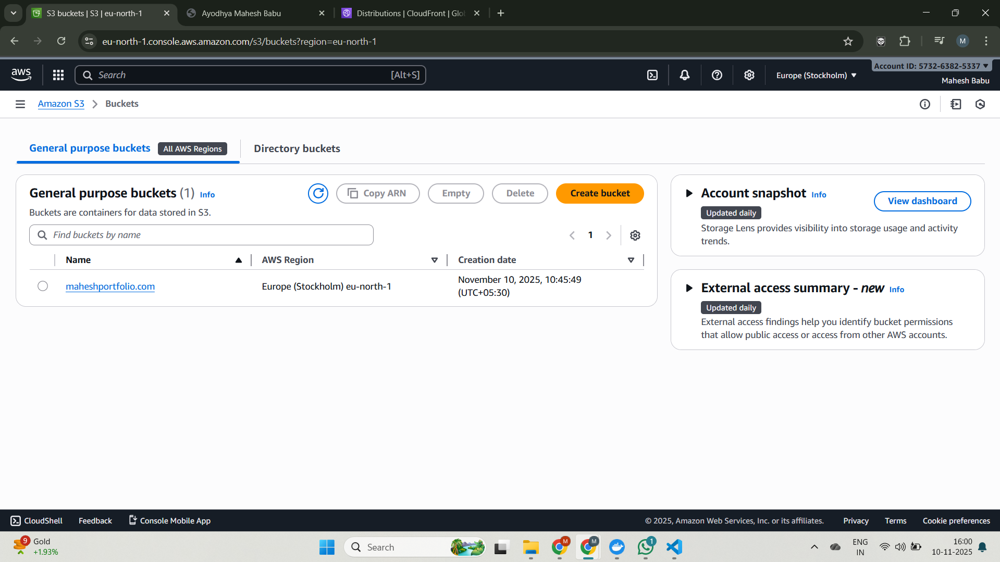
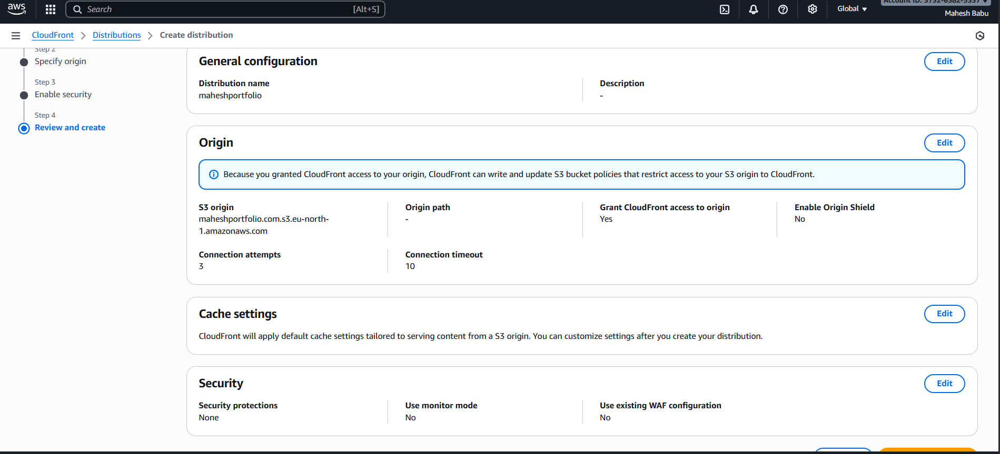
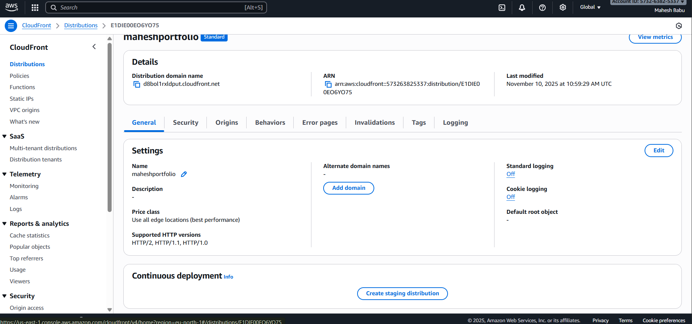
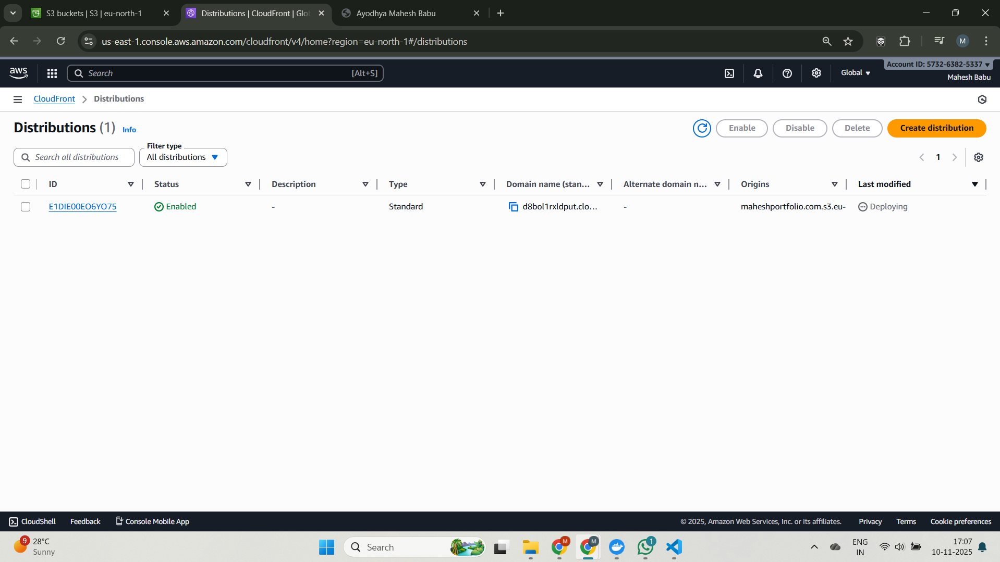
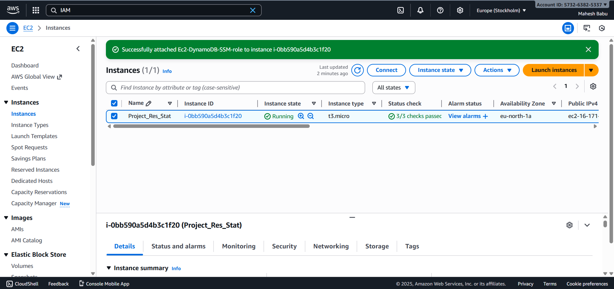
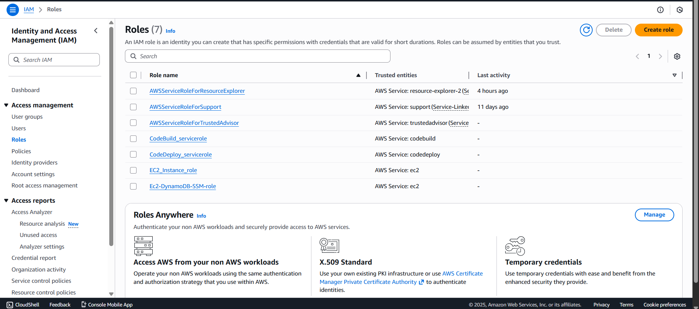
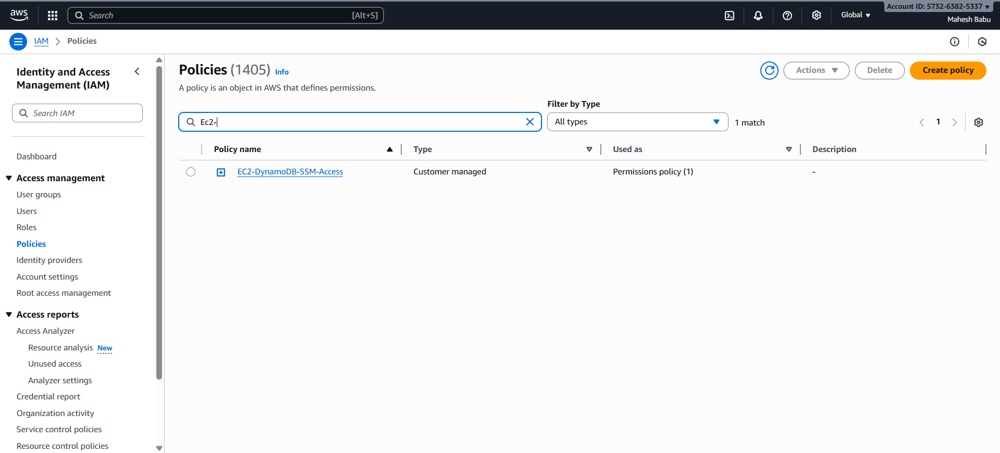
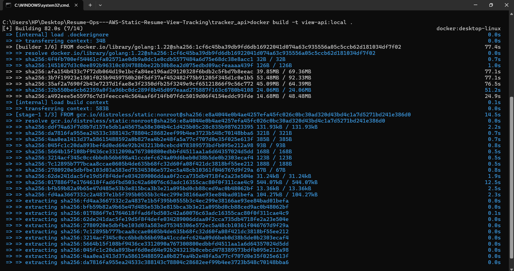
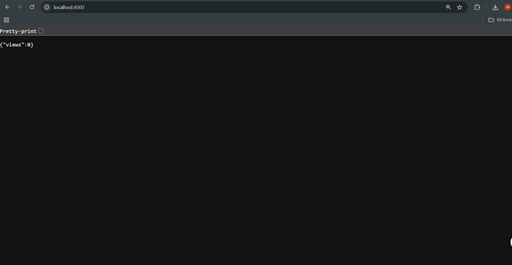

# AWS Full Stack Resume Project.
v1.0.0

> 1. Developed a professional resume website hosted on AWS, utilizing various AWS services for robustness and security.
> 2. Leveraged AWS CloudFront CDN for efficient content delivery and AWS S3 bucket for hosting static website content, ensuring scalability and reliability.
> 3. Implemented HTTPS protocol for enhanced security, supported by SSL/TLS certificate managed by AWS Certificate Manager.
> 4. Managed DNS with AWS Route 53 for seamless domain management and resolution.
> 5. Engineered a view tracking API using Go language, integrated with AWS DynamoDB for efficient data storage and retrieval.
> 6. Containerized the View Tracking API using Docker for streamlined deployment and scalability.
> 7. Orchestrated deployment pipeline on AWS utilizing AWS CodePipeline, CodeBuild, and CodeDeploy for automated building, testing, and deployment of the API Docker image.
> 8. Employed various AWS services including IAM Roles and IAM Users for secure access management and authorization.

Output Screenshots:

> 1.S3 bucket `maheshportfolio.com` in eu-north-1 that stores the static resume files.

>
> 2. Static website assets (index.html, profile.jpg, risen.css) uploaded to the S3 bucket.
> 
>
> 3.CloudFront distribution configured with the S3 bucket as origin; CloudFront access to the origin is granted.
> 
>
> 4. Details of the CloudFront distribution used to accelerate the static site (distribution domain shown).
> 
>
> 5. CloudFront distributions list — the distribution for the static portfolio is enabled and deploying.
> 
>
> 6. DynamoDB table `portfolio_views` (On-demand) used by the backend to store page view counts.
> 
>
> 7. EC2 instance (`Project_Res_Stat`) used as the deployment target for the containerized API.
> 
>
> 8. IAM roles created for CodeBuild, CodeDeploy and the EC2 instance (used for pipeline permissions).
> 
>
> 9. Custom IAM policy `EC2-DynamoDB-SSM-Access` attached to the EC2 role for DynamoDB and SSM parameter access.
> 
>
> 10. Docker build output demonstrating successful layer extraction and image build for `view-api`.
> 
>
> 11. Local test of the `view-api` running on `localhost:4000` — API returns JSON `{ "views": 0 }` indicating successful response from the backend.
> 
>
> 12. The static portfolio website served via the CloudFront distribution (demonstrates S3→CloudFront hosting for the resume site).
> 

See the full details here [Website](https://ayodhya16.github.io/Ayodhya-Mahesh-Babu-Portfolio/projects/aws_resume/).